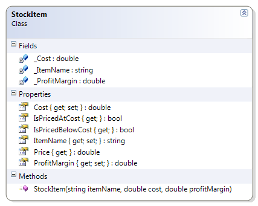

# StockItem

The StockItem class represents an inventory item that is kept in stock. The item's description, cost and profit margin are all part of the class design. Empty descriptions and zero or negative costs, as well as profit margins less than -100, are not allowed.

**Problem Statement**

Write the code for adding validation to the StockItem class. The solution must meet the following requirements (new requirements are in **bold**):

* Should get and set the name, cost and profit margin of the stock item
* Should calculate the price of the item, to the nearest cent, using the profit margin as a percent (a profit margin of 45 means 45%)
  * Use the rounding where values under a half-cent are rounded down and values greater than or equal to a half-cent are rounded up
* Should recognize when the stock item is priced at cost (that is, the profit margin is zero)
* Should recognize when the stock item is priced below cost (that is, the profit margin is negative)
* **Should reject an empty (or null) item name**
* **Should trim excess spaces from the ends of the item name**
* **Should require cost to be greater than zero**
* **Should only allow negative profit margins up to 100% (which is a full mark-down)**

Use the following class diagram when creating your solution.


 
```csharp
    private double _Cost;
    public double Cost
    {
        get
        {
            return _Cost;
        }
        set
        {
            if (value <= 0)
                throw new Exception("Cost must be positive");
            _Cost = value;
        }
    }

    private double _ProfitMargin;
    public double ProfitMargin
    {
        get
        {
            return _ProfitMargin;
        }
        set
        {
            if (value < -100)
                throw new Exception("A profit margin below 100% (more than the cost) is not allowed");
            _ProfitMargin = value;
        }
    }

    private string _ItemName;
    public string ItemName
    {
        get
        {
            return _ItemName;
        }
        set
        {
            if (string.IsNullOrEmpty(value) || string.IsNullOrEmpty(value.Trim()))
                throw new Exception("ItemName cannot be empty");
            _ItemName = value.Trim();
        }
    }
```
