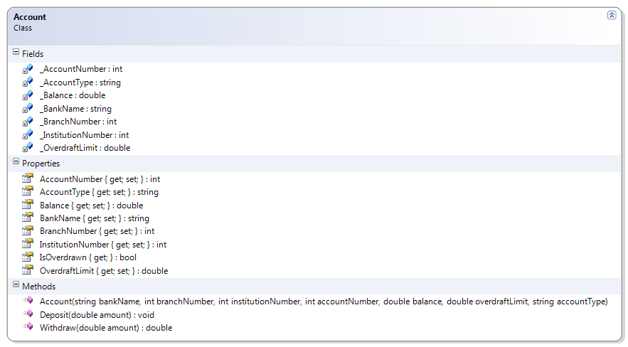

---
---
# Account

**Problem Statement**

Write the code that will add another piece of validation to the Account class. The solution must meet the following requirements (new requirements are in **bold**):

* Should get the bank name, branch number, institution number, account number, balance, overdraft limit, and account type and allow the overdraft limit to be set
* Should support deposits
* Should only support withdrawals if the amount does not exceed the sum of the balance and the overdraft limit, otherwise an exception stating "Insufficient Funds" should occur
* Should identify if the account is overdrawn
* Should require bank name and account type (that is, they cannot be empty or null)
* Should trim the bank name and account type
* Should verify that the branch number is six digits and the institution number is three digits
* Should require an opening balance
* Should not allow a negative overdraft limit
* **Should only allow positive, non-zero amounts when performing a deposit or withdrawal**

Use the following class diagram when creating your solution.

