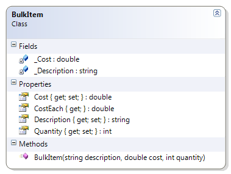

# BulkItem

The description cannot be blank and the cost and quantity values must be greater than zero.

**Problem Statement**

Write the code for the BulkItem class. The solution must meet the following requirements (new requirements are in **bold**):

* Should get and set the cost and quantity of the bulk item
* **Should get and set the description**
* **Should ensure the description is not empty (and that it is trimmed)**
* **Should ensure the cost and quantity values are greater than zero**
* Should calculate the cost for each item in the bulk item
* Should properly round values for currency (either the US or Canadian dollar)

Use the following class diagram when creating your solution.
 

