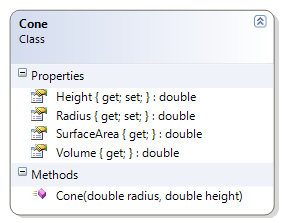

---
---
# Cone

The radius and height of the cone must be greater than zero.

**Problem Statement**

Write the code to provide validation for the Cone class that meets the following requirements (new requirements are in **bold**):

* Should get the radius and the height
* Should calculate the volume and the surface area
* **Should require the radius and height to be greater than zero**

Use the following class diagram when creating your solution.
 

