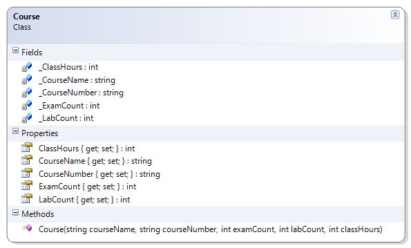

# Course

The course name and number cannot be blank, and the exam and lab counts must be greater than zero. The class hours must also be greater than zero.

**Problem Statement**

Write the code to provide validation for the Course class. The solution must meet the following requirements (new requirements are in **bold**):

* Should get the course name and number, the number of exams and labs, and the class hours for the course.
* **Should not allow empty course names or numbers**
* **Should trim spaces from the course name and number**
* **Should require class hours as well as lab and exam counts to be greater than zero**

