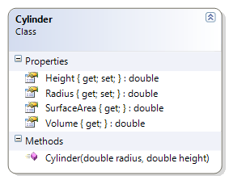

# Cylinder

The radius and height of the cylinder must be greater than zero.

**Problem Statement**

Write the code to provide validation for the Cylinder class that meets the following requirements (new requirements are in **bold**):

* Should get the radius and the height
* Should calculate the volume and the surface area
* **Should make sure the radius and height are greater than zero**

Use the following class diagram when creating your solution.
 

