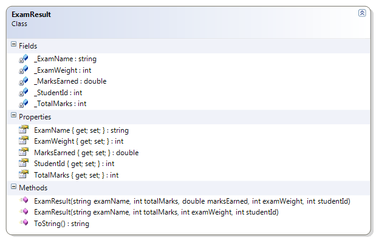

---
---
# ExamResult

Requires a positive, non-zero value for the total marks and weight. The weight cannot be over 50. The marks earned can be between zero and the total marks, inclusive. The student ID must be 9 digits, and the exam name cannot be an empty string.

**Problem Statement**

Write the code to provide validation for the ExamResult class. The solution must meet the following requirements (new requirements are in **bold**):

* Should get the name, student Id, total marks, and exam weight
* Should get and set the marks earned
* Should override the toString() to show
  "The student (studentId) received earnedMarks/totalMarks for this examName exam."
* **Should require the total marks and weight to be a positive, non-zero value**
* **Should not allow a weight over 50**
* **The marks earned must be between zero and the total possible marks, inclusive**
* **The student ID must be nine digits**
* **The exam name cannot be an empty string (and must be trimmed)**

