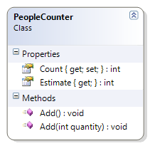

---
---
# PeopleCounter

Does not allow adding a negative number of people to the counter.

**Problem Statement**

Write the code needed to track people entering and leaving a store. It must be able to estimate the number of people that have entered the store at the end of the day. The solution must meet the following requirements (new requirements are in **bold**):

* Should default to having a count of zero people when first started up
* Should increment by one (that is, count a single person)
* Should increment by a specified quantity (for when a group of people enter)
* Should adequately estimate the number of people who entered the store, assuming that each person who enters also leaves the store
  Each estimate should be rounded down; for example, if 15 people are counted, then the estimate should be for only 7 (not 7.5 or 8)
* **Should not allow a zero or negative quantity when adding to the counter**

Use the following class diagram when creating your solution.
 

