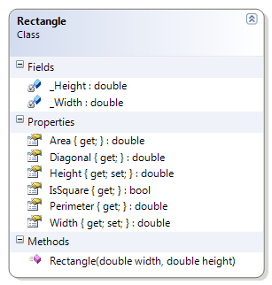

# Rectangle

The height and width of the rectangle must be greater than zero.

**Problem Statement**

Write the code to provide validation for the Rectangle class. The solution must meet the following requirements (new requirements are in **bold**):

* Should get and set the height and the width
* Should calculate the area, the perimeter and the diagonal
* The formula for the diagonal is √(〖width〗^2  + 〖height〗^2 )
* Should determine if the rectangle is a square
* **Should require the height and width to be greater than zero**

Use the following class diagram when creating your solution.
 

