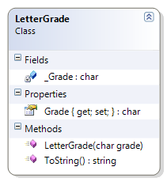

# LetterGrade

**Problem Statement**

Write the code for the LetterGrade class that represents a letter grade as assigned in Quebec universities (Source: http://en.wikipedia.org/wiki/Letter_grade). The solution must meet the following requirements (note – you do not need to perform validation for this sample):

* Should get and set the grade (as a single letter)
* Should ensure the grade is in upper-case
* Should get the appropriate descriptions for the grade, based on the following table:

Grade | Description
------|--------------------------------------
A     | A - 80-100% - Greatly Above Standards
B     | B - 70-79% - Above Standards
C     | C - 60-69% - At Government Standards
D     | D - 50-60% - Lower Standards
F     | F - 0-49% - Failure

Use the following class diagram when creating your solution.


 
```csharp
public class LetterGrade
{
    private char _Grade;

    public char Grade
    {
        get { return _Grade; }
        set { this._Grade = char.ToUpper(value); }
    }

    public LetterGrade(char grade)
    {
        Grade = grade;
    }


    public override string ToString()
    {
        string description;
        switch (_Grade)
        {
            case 'A':
                description = "A - 80-100% - Greatly Above Standards";
                break;
            case 'B':
                description = "B - 70-79% - Above Standards";
                break;
            case 'C':
                description = "C - 60-69% - At Government Standards";
                break;
            case 'D':
                description = "D - 50-60% - Lower Standards";
                break;
            case 'F':
                description = "F - 0-49% - Failure";
                break;
            default:
                description = "Invalid Letter Grade";
                break;
        }
        return description;
    }
}
```
