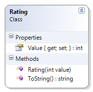

# Rating

**Problem Statement**

Write the code for the Rating class that represents a rating on a survey where the rating is done using the values 1 through 5, inclusive. The solution must meet the following requirements (note – you do not need to perform validation for this sample):

* Should get and set the rating value
* Should get the appropriate string result when using the ToString() method, based on the following table:

Value | Description
------|------------
1     | very bad
2     | bad
3     | average
4     | good
5     | very good

Use the following class diagram when creating your solution.
 


```csharp
public class Rating
{
    public int Value { get; set; }

    public Rating(int value)
    {
        Value = value;
    }


    public override string ToString()
    {
        string rating;
        switch (Value)
        {
            case 5:
                rating = "very good";
                break;
            case 4:
                rating = "good";
                break;
            case 3:
                rating = "average";
                break;
            case 2:
                rating = "bad";
                break;
            case 1:
                rating = "very bad";
                break;
            default:
                rating = "Invalid Rating";
                break;
        }
        return rating;
    }
}
```
