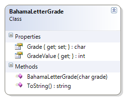

---
---
# BahamaLetterGrade

**Problem Statement**

Write the code for the BahamaLetterGrade class that represents a letter grade as assigned in the Bahamas universities (Source: http://en.wikipedia.org/wiki/Letter_grade). Each letter grade is also associated with a grade value. The solution must meet the following requirements (note – you do not need to perform validation for this exercise):

* Should get and set the grade (as a single letter)
* Should ensure the grade is in upper-case
* Should get the appropriate descriptions for the grade, based on the following table:

Grade | Grade Value | Description
------|-------------|--------------
A     | 4           | A-4 - 90-100%
B     | 3           | B-3 - 71-89%
C     | 2           | C-2 - 56-70%
D     | 1           | D-1 - 46-55%
F     | 0           | F-0 - 0-45%

Use the following class diagram when creating your solution.

