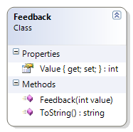

---
---
# Feedback

Represents an opinion rating as feedback, where 1 is "no opinion", 2 is "strongly disagree", 3 is "disagree", 4 is "agree, and 5 is "strongly agree".

**Problem Statement**

Write the code for the Feedback class that represents a rating on a survey where the feedback is given using the values 1 through 5, inclusive. The solution must meet the following requirements (note – you do not need to perform validation for this sample):

* Should get and set the feedback value
* Should get the appropriate string result when using the ToString() method, based on the following table:

Value | Description
------|------------------
1     | no opinion
2     | strongly disagree
3     | disagree
4     | agree
5     | strongly agree

Use the following class diagram when creating your solution.

