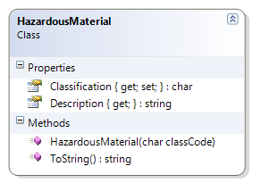

---
---
# HazardousMaterial

The class code for the hazardous material can only be the letters 'A' through 'F', inclusive.

**Problem Statement**

Rewrite the code for the HazardousMaterial class to make use of the switch statement. The solution must meet the following requirements (new requirements are in **bold**):

* Should return the class code as the classification
* Should make sure only class codes 'A' through 'F' are allowed (in either upper or lower case)
* Should make sure the classification is stored in upper case
* Should get the description for the class, based on the following table
  **You must use a switch statement to get the results**

Class Code | Description
-----------|-----------------------------------
A          | Compressed Gas
B          | Flammable and Combustible Material
C          | Oxidizing Material
D          | Poisonous and Infectious Material
E          | Corrosive Material
F          | Dangerously Reactive Material

* Should override the ToString() method to get the full description and class code in the following format:
  * "Class ClassCode - Description"

Use the following class diagram when creating your solution.

