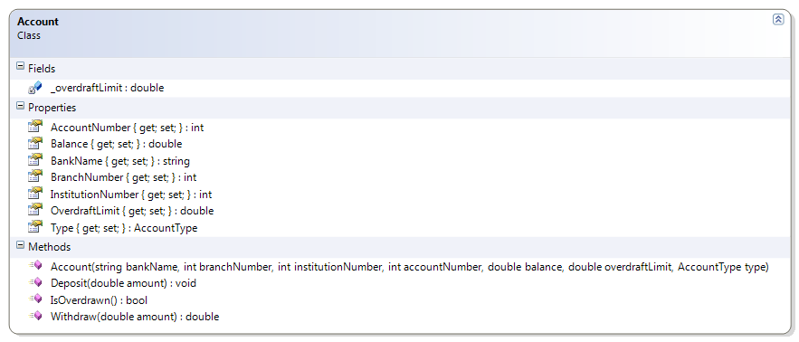

# Account + AccountType

The Account’s account type is n  * longer being represented as a string, but is its own enumeration: AccountType.


**Problem Statement**

Write the code that will make the account type a type-safe value for the Account class. The solution must meet the following requirements (new requirements are in **bold**):

* Should get the bank name, branch number, institution number, account number, balance, overdraft limit, and account type and allow the overdraft limit to be set
* Should support deposits
* Should only support withdrawals if the amount does not exceed the sum of the balance and the overdraft limit, otherwise an exception stating "Insufficient Funds" should occur
* Should identify if the account is overdrawn
* Should require bank name and account type (that is, they cannot be empty or null)
* Should trim the bank name
* **Should ensure that the Account Type is type-safe and that it is supplied when creating the account (that is, it cannot be null)** 
* **Should support the following types of accounts: Chequing, Saving, Credit Card, and Line of Credit**
* Should verify that the branch number is six digits and the institution number is three digits
* Should require an opening balance
* Should not allow a negative overdraft limit

Use the following class diagram when creating your solution.


 
```csharp
public class Account
{
    public Account(string bankName, int branchNumber, int institutionNumber,
            int accountNumber, double balance, double overdraftLimit,
            AccountType type)
    {
        if (string.IsNullOrEmpty(bankName) ||
            string.IsNullOrEmpty(bankName.Trim()))
            throw new System.Exception("Bank name cannot be empty");
        if (branchNumber < 10000 || branchNumber > 99999)
            throw new System.Exception("Branch number must be 5 digits");
        if (institutionNumber < 100 || institutionNumber > 999)
            throw new System.Exception("Institution number must be 3 digits");
        if (balance <= 0)
            throw new System.Exception("Opening balance must be greater than zero");
        OverdraftLimit =overdraftLimit;
        this.BankName = bankName;
        this.BranchNumber = branchNumber;
        this.InstitutionNumber = institutionNumber;
        this.AccountNumber = accountNumber;
        this.Balance = balance;
        this.Type = type;
    }

    private double _overdraftLimit;

    public double Balance { get; private set; }
    public string BankName { get; private set; }
    public int BranchNumber { get; private set; }
    public int InstitutionNumber { get; private set; }
    public int AccountNumber { get; private set; }
    public AccountType Type { get; private set; }

    public double OverdraftLimit
    {
        get
        { return _overdraftLimit; }
        set
        {
            if (value < 0)
                throw new System.Exception("Negative overdraft limits not allowed");
            this._overdraftLimit = value;
        }
    }

    public bool IsOverdrawn()
    {
        return Balance < 0.0;
    }

    public void Deposit(double amount)
    {
        Balance += amount;
    }

    public double Withdraw(double amount)
    {
        if (amount > Balance + _overdraftLimit)
            throw new System.Exception("Insufficient Funds");
        Balance -= amount;
        return amount;
    }
}
```
