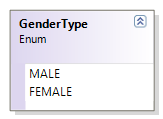
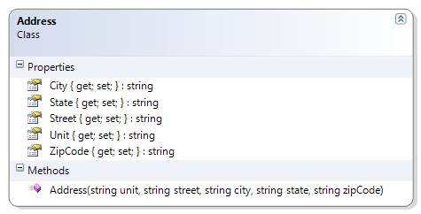
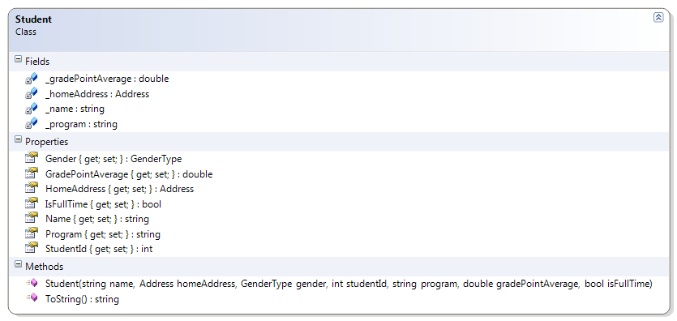

# Address + Student + GenderType

This revised version of the Student class now has an Address field. The address field is new; although similar to the CanadianAddress class, the Address class is simpler and more "generic" (having "State" instead of "Province" and "ZipCode" instead of "PostalCode").



**Problem Statement**

Extend the Student class to now include information about the student's home address. Create an Address class to represent a simple, generic address. In addition, the Student class must represent the Gender using an enumeration.

The solution must meet the following requirements (new requirements are in **bold**):

* **The Address class must**
  * **Get and set the city, state, street, unit and zip code.**
* The Student class must
  * **Verify that an address object is supplied (is not null)**
  * **Represent the Gender as a GenderType of Male and Female**
  * Should get and set the student's name, gender, GPA, program of studies, and whether or not the student is full-time.
  * Should override the toString() method to get the student's ID and name in this format:
    (ID) Name
  * Should no longer allow the student ID to be set (it's only set through the constructor)
  * Should reject empty text (and null values) for the student's name and program of studies.
  * Should trim the student's name and the program name
  * Should only accept ‘M' and ‘F' as valid genders
  * Should set the gender to upper-case
  * Should reject negative GPAs and GPAs over 9

Use the following class diagrams to guide your design.
 



 
```csharp
public enum GenderType
{
    MALE, FEMALE
}

public class Address
{
    public string Street { get; set; }
    public string Unit { get; set; }
    public string City { get; set; }
    public string State { get; set; }
    public string ZipCode { get; set; }

    public Address(string unit, string street, string city, string state,
            string zipCode)
    {
        this.Unit = unit;
        this.Street = street;
        this.City = city;
        this.State = state;
        this.ZipCode = zipCode;
    }
}

public class Student
{
    private string _name; // The full name of the student
    private string _program; // The course program; e.g.: "CST"
    private double _gradePointAverage; // GPA is from 1.0 to 9.0
    private Address _homeAddress;

    public Student(string name, Address homeAddress, GenderType gender,
        int studentId, string program, double gradePointAverage,
        bool isFullTime)
    {
        if (studentId < 100000000 || studentId > 999999999)
            throw new System.Exception("Student Ids must be 9 digits");
        Name = name;
        HomeAddress = homeAddress;
        Gender = gender;
        StudentId = studentId;
        Program = program;
        GradePointAverage = gradePointAverage;
        IsFullTime = isFullTime;
    }

    public GenderType Gender { get; set; }
    public bool IsFullTime { get; set; }
    public int StudentId { get; private set; }

    public string Name
    {
        get
        { return _name; }
        set
        {
            if (string.IsNullOrEmpty(value) ||
                string.IsNullOrEmpty(value.Trim()))
                throw new System.Exception("name cannot be empty");
            this._name = value.Trim();
        }
    }

    public Address HomeAddress
    {
        get
        { return _homeAddress; }
        set
        {
            if (value == null)
                throw new System.Exception("Address is required");
            this._homeAddress = value;
        }
    }

    public string Program
    {
        get
        { return _program; }
        set
        {
            if (string.IsNullOrEmpty(value) ||
                string.IsNullOrEmpty(value.Trim()))
                throw new System.Exception("Program cannot be empty");
            this._program = value.Trim();
        }
    }

    public double GradePointAverage
    {
        get
        { return _gradePointAverage; }
        set
        {
            if (value < 0 || value > 9)
                throw new System.Exception("GPA must be between 0 and 9 inclusive");
            this._gradePointAverage = value;
        }
    }


    public override string ToString()
    {
        return "(" + StudentId + ") " + Name;
    }
}
```
