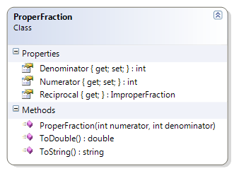
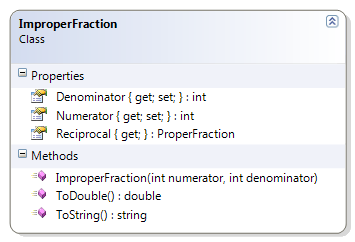
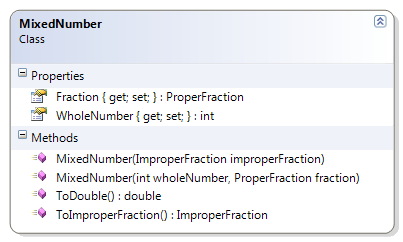

# ImproperFraction + MixedNumber + ProperFraction

In this sample, the idea of a Fraction class is made more specific by replacing it with three more specific types of numbers: MixedNumber, ProperFraction, and ImproperFraction. A MixedNumber is made up of a whole number and a ProperFraction. A MixedNumber can also be expressed as or derived from an ImproperFraction. The reciprocal of a ProperFraction is an ImproperFraction and the reciprocal of an ImproperFraction is a ProperFraction.

**Problem Statement**

The generic Fraction class is now being replaced with a set of three more specific classes for numbers with fractional values: ProperFraction, ImproperFraction, and MixedNumber. Create these classes, using the following requirements and class diagrams.

  * ProperFraction should ensure that it is indeed a proper fraction
  * ImproperFraction should ensure that it is indeed an improper fraction
  * MixedNumber should construct either from a whole number and a proper fraction or from an improper fraction
  * ProperFraction and ImproperFraction should get their respective reciprocals as well as their values as real numbers
  * ProperFraction and ImproperFraction should ensure that the denominator is always positive
  * MixedNumber should get the whole number portion as well as the fractional portion
  * MixedNumber should get its value as a real number as well as get its value as an ImproperFraction







```csharp
public class ProperFraction
{
    public ProperFraction(int numerator, int denominator)
    {
        if (denominator == 0)
            throw new System.Exception("zero denominator fractions are undefined");
        if (Math.Abs(numerator) >= Math.Abs(denominator))
            throw new System.Exception("Proper fractions must have a numerator that is less than the denominator");

        if (denominator < 0)
        {
            numerator *= -1;
            denominator *= -1;
        }
        this.Numerator = numerator;
        this.Denominator = denominator;
    }

    public int Numerator { get; private set; }
    public int Denominator { get; private set; }
    public ImproperFraction Reciprocal
    {
        get
        { return new ImproperFraction(Denominator, Numerator); }
    }

    public double ToDouble()
    {
        return (double)(Numerator) / Denominator;
    }

    public override string ToString()
    {
        return Numerator + "/" + Denominator;
    }
}

public class ImproperFraction
{
    public ImproperFraction(int numerator, int denominator)
    {
        if (denominator == 0)
            throw new System.Exception("zero denominator fractions are undefined");
        if (Math.Abs(numerator) < Math.Abs(denominator))
            throw new System.Exception("Improper fractions must have a numerator that is greater than or equal to the denominator");

        if (denominator < 0)
        {
            numerator *= -1;
            denominator *= -1;
        }
        this.Numerator = numerator;
        this.Denominator = denominator;
    }

    public int Numerator { get; private set; }
    public int Denominator { get; private set; }
    public ProperFraction Reciprocal
    {
        get { return new ProperFraction(Denominator, Numerator); }
    }

    public double ToDouble()
    {
        return (double)(Numerator) / Denominator;
    }

    public override string ToString()
    {
        return Numerator + "/" + Denominator;
    }
}

public class MixedNumber
{
    public int WholeNumber { get; private set; }
    public ProperFraction Fraction { get; private set; }

    public MixedNumber(int wholeNumber, ProperFraction fraction)
    {
        if (wholeNumber == 0)
            throw new System.Exception("wholeNumber portion cannot be zero for a Mixed Number");
        if (fraction == null)
            throw new System.Exception("MixedNumbers must have a fractional portion");
        if (fraction.Numerator < 0)
        {
            fraction = new ProperFraction(-fraction.Numerator, fraction.Denominator);
            wholeNumber *= -1;
        }
        this.WholeNumber = wholeNumber;
        this.Fraction = fraction;
    }

    public MixedNumber(ImproperFraction improperFraction) :
        this(improperFraction.Numerator / improperFraction.Denominator,
              new ProperFraction(improperFraction.Numerator %
                                improperFraction.Denominator,
                                improperFraction.Denominator))
    {
    }

    public ImproperFraction ToImproperFraction()
    {
        return new ImproperFraction(WholeNumber * 
                                    Fraction.Denominator + Fraction.Numerator,
                                    Fraction.Denominator);
    }

    public double ToDouble()
    {
        double realValue = Math.Abs(WholeNumber) + Fraction.ToDouble();
        if (WholeNumber < 0)
            realValue *= -1;
        return realValue;
    }
}
```
