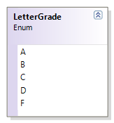

---
---
# LetterGrade + QuebecLetterGrade

The QuebecLetterGrade uses the simple LetterGrade enumeration and assigns specific ranges of percentage marks for the possible LetterGrade values.

**Problem Statement**

Write the code for the LetterGrade class that represents a letter grade as assigned in Quebec universities (Source: http://en.wikipedia.org/wiki/Letter_grade). The solution must meet the following requirements (new requirements are in **bold**):

* **Should get and set the grade as a type-safe value**
* Should get the appropriate descriptions for the grade, based on the following table:

Grade | Description
A     | A - 80-100% - Greatly Above Standards
B     | B - 70-79% - Above Standards
C     | C - 60-69% - At Government Standards
D     | D - 50-60% - Lower Standards
F     | F - 0-49% - Failure

Use the following class diagram when creating your solution.




```csharp
public enum LetterGrade
{
    A, B, C, D, F
}

public class QuebecLetterGrade
{
    public LetterGrade Grade { get; set; }

    public QuebecLetterGrade(LetterGrade grade)
    {
        this.Grade = grade;
    }

    public override string ToString()
    {
        string description;
        switch (Grade)
        {
            case LetterGrade.A:
                description = "A - 80-100% - Greatly Above Standards";
                break;
            case LetterGrade.B:
                description = "B - 70-79% - Above Standards";
                break;
            case LetterGrade.C:
                description = "C - 60-69% - At Government Standards";
                break;
            case LetterGrade.D:
                description = "D - 50-60% - Lower Standards";
                break;
            case LetterGrade.F:
                description = "F - 0-49% - Failure";
                break;
            default:
                description = "Invalid Letter Grade";
                break;
        }
        return description;
    }
}
```
