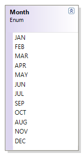
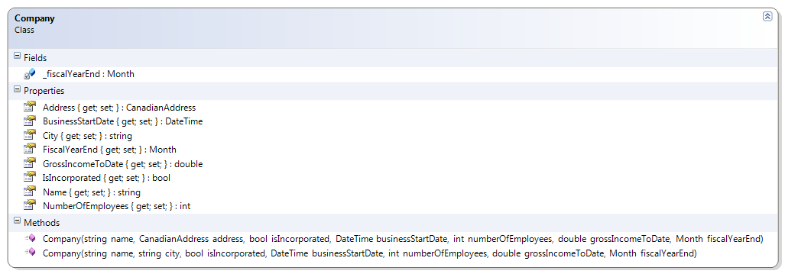

---
---
# Company + Month + CanadianAddress + Province

The Company now has a CanadianAddress.

**Problem Statement**

Modify the Company class to now make use of the CanadianAddress type for the address. Also, create an enumeration for the months of the year for representing the company’s fiscal year end.
 

