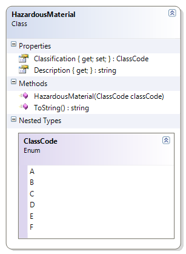

# HazardousMaterial + ClassCode

The various types of hazardous materials are now identified by their ClassCode enumerated type.

**Problem Statement**

Rewrite the code for the HazardousMaterial class to make use of the ClassCode enumerated type. The solution must meet the following requirements (new requirements are in green, bold italic font):

* Should return the class code as the classification
* Should make sure the class code is supplied (is not null)
* Should get the description for the class, based on the following table
  You must use a switch statement to get the results

Class Code | Description
-----------|-----------------------------------
A          | Compressed Gas
B          | Flammable and Combustible Material
C          | Oxidizing Material
D          | Poisonous and Infectious Material
E          | Corrosive Material
F          | Dangerously Reactive Material

* Should override the ToString() method to get the full description and class code in the following format:
  * "Class ClassCode - Description"

Use the following class diagram when creating your solution.
 

