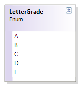
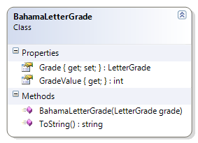

# LetterGrade + BahamaLetterGrade

The BahamaLetterGrade also uses the LetterGrade enumerated type, assigning its own specific ranges and values to the possible LetterGrade values.

**Problem Statement**

Write the code for the BahamaLetterGrade class and the LetterGrade enumeration to represent a letter grade as assigned in universities in the Bahamas. (For more information on Bahaman letter grades, see http://en.wikipedia.org/wiki/Letter_grade.) . The solution must meet the following requirements (new requirements are in green, bold italic font):

* The LetterGrade enumeration should be "generic" and support letter grades of A through F inclusive
* The BahamaLetterGrade should reject the LetterGrade of E (which is not allowed in the Bahamas) as well as any null letter grade
* The BahamaLetterGrade should get the appropriate descriptions for the grade, based on the following table:

Grade | Grade | Value Description
------|-------|------------------
A     | 4     | A-4 - 90-100%
B     | 3     | B-3 - 71-89%
C     | 2     | C-2 - 56-70%
D     | 1     | D-1 - 46-55%
F     | 0     | F-0 - 0-45%

Use the following class diagram when creating your solution.

