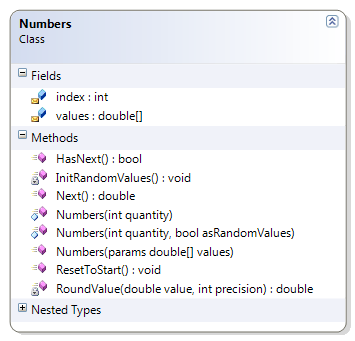
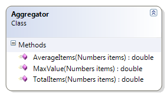

---
---
# Aggregator

The Aggregator class supports static methods for doing various types of aggregation on Numbers. (Numbers is a supplied class that stores a series of real values that can be obtained by calling GetNext().) The common aggregations of TotalItems(), AverageItems(), MaxValue() are given as examples of simple looping.

**The Numbers Class**

The methods of the Aggregator class all take a single argument: a Numbers object. The Numbers object contains a bunch of real numbers and it has two methods that the Aggregator methods will use:

* HasNext() – This returns a Boolean indicating that the object has another number available.
* GetNext() – This returns a real number from the set of values in the Numbers object.

For example, if a Numbers object has a set of four values such as 1.0, 5.5, 3.2, and 5.3, then the GetNext() method can be called four times to retrieve each value. Any attempt to call GetNext() when the object’s HasNext() is false will cause an exception.

*Note:* This class is already coded for you in the samples.


 
**Aggregator Methods**

The following Aggregator methods will demonstrate looping logic and syntax. All of these examples demonstrate the while statement.

* TotalItems() – This method loops through all the values inside of the Numbers object to calculate and return the total of the values. 
* AverageItems() – This method gets all the values inside of the Numbers object so as to calculate the average value. If no values exist in the Numbers object, then the method returns an average of zero.
* MaxValue() – This method examines the Numbers object’s values to see which value is the largest. If there are no values inside of the Numbers object, then the method returns the smallest possible value that is supported by the programming language.


 
```csharp
public class Aggregator
{
    public static double TotalItems(Numbers items)
    {
        double total = 0;
        while (items.HasNext())
            total += items.Next();
        return total;
    }

    public static double AverageItems(Numbers items)
    {
        double average, total = 0;
        int count = 0;
        while (items.HasNext())
        {
            total += items.Next();
            count++;
        }
        if (count > 0)
            average = total / count;
        else
            average = 0;
        return average;
    }

    public static double MaxValue(Numbers items)
    {
        double max = double.MinValue;
        while (items.HasNext())
        {
            double value = items.Next();
            if (max < value)
                max = value;
        }
        return max;
    }
}
```
