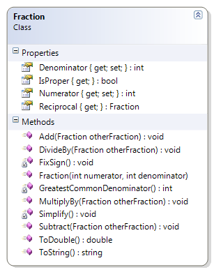

# Fraction

The fraction example is now enhanced to simplify the fractional value by finding the greatest common denominator of the fraction’s numerator and denominator.

The Fraction class represents a fraction as two integers: one for the numerator and one for the denominator. When a Fraction object is created, the class must now simplify the fractional values by calculating the greatest common denominator.

* GreatestCommonDenominator() – This private method is used by the Simplify() method to get the greatest common denominator for the numerator and denominator. Remember to allow for dealing with negative fractions (in which case, the negative sign will be on the numerator). This example uses a while statement (though it is possible to re-work the logic to use a do-while statement).


 
```csharp
    private int GreatestCommonDenominator()
    {
        int commonDenominator = 1;
        int count = 2, halfWay;
        int absoluteNumerator = System.Math.Abs(Numerator);
        if (absoluteNumerator > Denominator)
            halfWay = absoluteNumerator / 2;
        else
            halfWay = Denominator / 2;

        while (count <= halfWay)
        {
            if (absoluteNumerator % count == 0 && 
                Denominator % count == 0)
                commonDenominator = count;
            count++;
        }

        return commonDenominator;
    }
```
