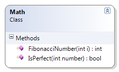

# Math

The Math class provides methods for the following mathematical algorithms not found in the default Math class.

* FibonacciNumber() – Returns a number from the Fibonacci sequence for a given position. If the given position is less than or equal to zero, then this method should throw an exception. This example demonstrates the for statement. An alternative version illustrates the do-while statement.
* IsPerfect() – Indicates whether or not a number is a “perfect” number. A perfect number is a number where the sum of all the factors equals the number. By definition, any number less than 1 (including all negative numbers) are not perfect numbers. This example uses a while statement. An alternative version illustrates a do-while statement.



```csharp
public class Math
{
    public static int FibonacciNumber(int i)
    {
        int current = 1, previous = 1, beforePrevious = 0;
        if (i >= 1)
        {
            for (int counter = 3; counter <= i; counter++)
            {
                beforePrevious = previous;
                previous = current;
                current = beforePrevious + previous;
            }
        }
        else
            throw new Exception("Can only create a fibonacci number based on a positive non-zero position");
        return current;
    }

    public static bool IsPerfect(int number)
    {
        bool perfect = true;
        if (number <= 1)
            perfect = false;
        else
        {
            // The following logic attempts to prove it is imperfect
            int halfWay = number / 2;
            int total = 0;
            int count = 1;
            while (total != number && total <= halfWay && total < number)
            {
                if (number % count == 0) // Then count is a factor of number
                    total += count;
                count++;
            }
            if (total != number)
                perfect = false;
        }
        return perfect;
    }
}
```
