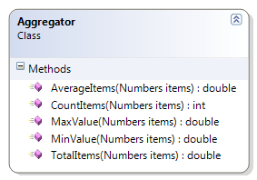

# Aggregator

Expand on the sample Aggregator class to perform the following aggregations.

* CountItems() – Return the count of the number of values in the Numbers object.
* MinValue() – Return the smallest value in the set of values of the supplied Numbers object. If no values exist in the Numbers object, return the largest whole number supported by the programming language.

