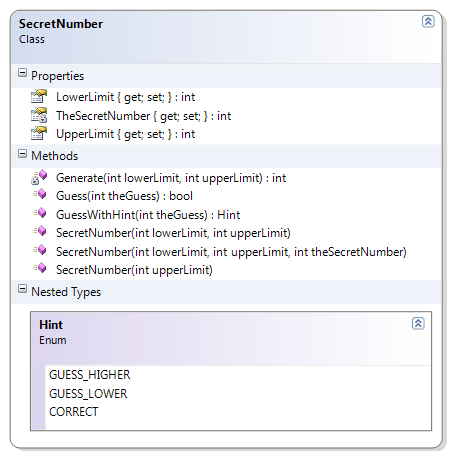
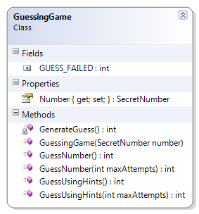

---
---
# GuessingGame

This example expands on the sample GuessingGame by adding more guess methods to make guessing more efficient by using the SecretNumber’s guessWithHint() method.

In a regular number guessing game between two people, one person asks another person to guess a whole number between a pair of values. In this example, two different classes take on the roles of the two people in the game: The SecretNumber class takes on the role of the person who has picked a value between some lower and upper limit, while the GuessingGame class takes on the role of the person who has to guess what that hidden number is.

**SecretNumber**

Objects of this class will store a hidden value between some upper and lower limit (inclusive). The SecretNumber class supports these public methods:

* GetLowerLimit() – Returns a number representing the lower end (inclusive) of the range of possible values for the hidden value.
* GetUpperLimit() – Returns a number representing the upper end (inclusive) of the range of possible values for the hidden value.
* GuessWithHint() – Returns CORRECT if the supplied value matches the hidden value, otherwise it returns GUESS_HIGHER if the attempted guess was too low or GUESS_LOWER if the attempted guess was too high.

*Note:* This class is already coded for you in the samples.

**GuessingGame**

This class simulates the action of guessing what hidden value is stored inside of a SecretNumber object. The SecretNumber is supplied to the constructor of the GuessingGame, and the following methods attempt to find out what that number is.

* GuessUsingHints() – This first method simply tries to guess the hidden value of the SecretNumber. It has “unlimited” guesses, and it will return the number of attempts it took to find out what that hidden number is. Use the GuessWithHint method of the SecretNumber object.
* GuessUsingHints(MaxAttempts : Integer) – This method will also try to guess the SecretNumber’s hidden value, but it is limited to a maximum number of guesses. This method will return the actual number of attempts it took to find the hidden value, or it will return the GUESS_FAILED constant if it was unable to guess the secret number. Use the GuessWithHint method of the SecretNumber object.
As an additional exercise, create a simple driver that instantiates a SecretNumber object and supplies it to a GuessingGame object. Show how many attempts it took to guess the hidden number when using hints.

