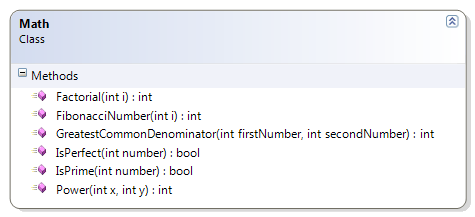

---
---
# Math

Expand on the sample Math class by providing methods to perform the following.

* Factorial() – Calculate the factorial of a given number. If the given number is negative, throw an exception. If the calculated value for the factorial will exceed the maximum integer value (int.MaxValue), then return zero (0) as a result.
* IsPrime() – Identify if a number is or is not a prime number. A prime number is a number with only two divisors: 1 and the number itself. By definition for this problem, numbers less than one are not considered prime numbers.
* Power() – Calculate the value of x to the power of y (as in xy). Use looping logic (addition) to get the result.
* GreatestCommonDenominator() – Find the greatest common denominator between two whole numbers.

