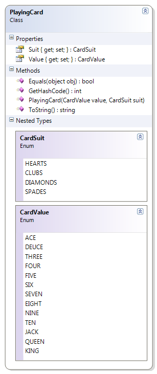
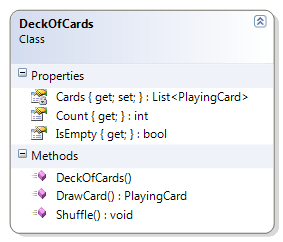

---
---
# DeckOfCards

The DeckOfCards class represents a complete deck of cards. When the deck is first created, a card is created for each suit. The DeckOfCards supports a method to draw a card. The following methods must be coded to complete the solution.

* Constructor – Create all the cards for all the CardSuit values and all the CardValue values.
* DrawCard() – Return the card at the “top” of the deck (that is, at position zero). If the deck is empty, return a null.
* Shuffle() – Mix up the order of the PlayingCards in the Cards list. Shuffle should work regardless of the number of cards still in the deck.

**PlayingCard and DeckOfCards**





```csharp
public class DeckOfCards
{
    private List<PlayingCard> Cards { get; set; }

    public int Count
    { get { return Cards.Count; } }

    public bool IsEmpty
    { get { return Count == 0; } }

    public DeckOfCards()
    {
        Cards = new List<PlayingCard>();
        foreach (PlayingCard.CardSuit suit in System.Enum.GetValues(typeof(PlayingCard.CardSuit)))
            foreach (PlayingCard.CardValue value in System.Enum.GetValues(typeof(PlayingCard.CardValue)))
                Cards.Add(new PlayingCard(value, suit));
    }

    public PlayingCard DrawCard()
    {
        PlayingCard card = null;
        if (Cards.Count != 0)
        {
            card = Cards[0];
            Cards.Remove(card);
        }
        return card;
    }

    public void Shuffle()
    {
        for (int counter = 0; counter < 100; counter++)
        {
            int index = Rnd.Next(Cards.Count);
            PlayingCard card = Cards[0];
            Cards.RemoveAt(0);
            Cards.Insert(index, card);
        }
    }
}
```
