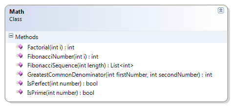

# Math

This sample leverages the existing calculation of a number in the Fibonacci sequence to generate the sequence itself.

* FibonacciSequence(Length : Integer) – This method generates the sequence of Fibonacci numbers to a specific length in the sequence.



```csharp
public static List<int> FibonacciSequence(int length)
{
    List<int> fib = new List<int>();
    if (length >= 1)
    {
        for (int index = 0; index < length; index++)
            fib.Add(FibonacciNumber(index + 1));
    }
    return fib;
}
```
