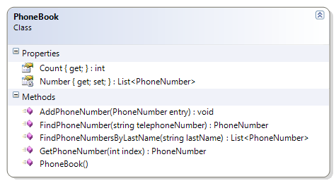

# PhoneBook

The PhoneBook class provides simple management of a collection of PhoneNumber objects. The PhoneBook allows for adding and retrieving phone numbers; it supports search for phone numbers by the telephone number or by a last name.

* Constructor – Create a new List<PhoneNumber> for the numbers field.
* AddPhoneNumber(Entry : PhoneNumber) – Add a PhoneNumber to the collection. Ensure that the PhoneNumber exists (is not null) before adding; if the PhoneNumber is null, throw an exception.
* GetPhoneNumber(Index : Integer) : PhoneNumber – Get an item from a particular position in the collection.
* GetCount() : Integer – Get the size of the collection, which is a count of how many PhoneNumber objects are in the collection.
* FindPhoneNumber(TelephoneNumber : String) : PhoneNumber – Look through the collection and return a PhoneNumber with a matching telephone number. If none is found, return null.
* FindPhoneNumbersByLastName(LastName : String) : List<PhoneNumber> - Look through the collection for PhoneNumber objects with a matching last name. Add those objects to a new collection and return the collection of matching PhoneNumbers. If no items are found, return an empty collection.

**Supporting Classes**

The PhoneNumber class used in this sample is provided for you. The following class diagram shows the design of this class.


 
**PhoneBook Class**



```csharp
public class PhoneBook
{
    private List<PhoneNumber> Number { get; set; }

    public PhoneBook()
    {
        Number = new List<PhoneNumber>();
    }

    public void AddPhoneNumber(PhoneNumber entry)
    {
        if (entry == null)
            throw new System.Exception("The phone number entry cannot be null");
        Number.Add(entry);
    }

    public PhoneNumber GetPhoneNumber(int index)
    {
        return Number[index];
    }

    public int Count
    {
        get
        {
            return Number.Count;
        }
    }

    public PhoneNumber FindPhoneNumber(string telephoneNumber)
    {
        PhoneNumber found = null;
        foreach (PhoneNumber item in Number)
        {
            if (item.Number.Equals(telephoneNumber))
            {
                found = item;
                break;
            }
        }
        return found;
    }

    public List<PhoneNumber> FindPhoneNumbersByLastName(string lastName)
    {
        List<PhoneNumber> found = new List<PhoneNumber>();
        foreach (PhoneNumber item in Number)
        {
            if (item.LastName.Equals(lastName))
            {
                found.Add(item);
            }
        }
        return found;
    }
}
```
