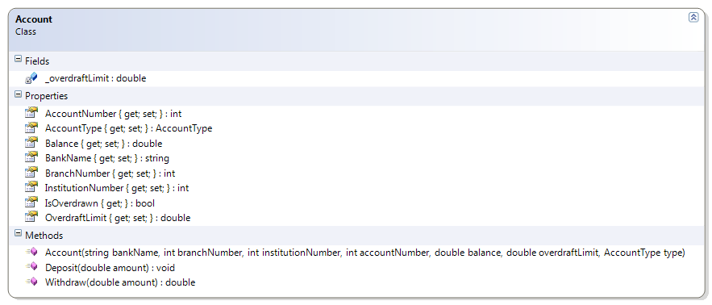
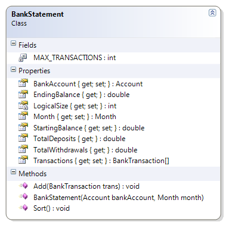
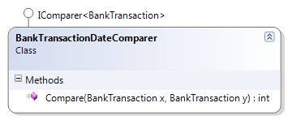

# BankStatement

This class represents a bank statement for a BankAccount for a given month. The statement allows BankTransaction objects to be added, and performs deposits and withdrawals on the BankAccount. The statement reports the starting and ending balance and also summarizes the total amount deposited and withdrawn for the month. The following methods must be coded to complete the solution.

* Add() - Add a BankTransaction to the array of transactions. If the BankTransaction is null, throw an exception. Otherwise, process the transaction as either a deposit or a withdrawal, depending on if the amount is positive or negative, and then add it to the array of transactions.
* GetTotalDeposits() - Loop through the array of transactions to total all those transactions with a positive amount.
* GetTotalWithdrawals() - Loop through the array of transactions to total all those transactions with a negative amount.
* Sort() - Sorts the array of transactions by date.
* Supporting Classes
  * Account -
  * BankTransaction - 
  * AccountType -




 




```csharp
public class BankStatement
{
    private const int MAX_TRANSACTIONS = 500;
    private int LogicalSize { get; set; }
    public Account BankAccount { get; private set; }
    public double StartingBalance { get; private set; }
    public Month Month { get; private set; }
    public BankTransaction[] Transactions { get; private set; }
    public double EndingBalance
    {
        get
        {
            return BankAccount.Balance;
        }
    }

    public BankStatement(Account bankAccount, Month month)
    {
        if (bankAccount == null)
            throw new Exception("Bank account cannot be null");
        this.BankAccount = bankAccount;
        this.StartingBalance = bankAccount.Balance;
        this.Month = month;
        this.Transactions = new BankTransaction[MAX_TRANSACTIONS];
        LogicalSize = 0;
    }

    public void Add(BankTransaction trans)
    {
        if (trans == null)
            throw new Exception("Cannot add null transactions");
        if (LogicalSize == MAX_TRANSACTIONS)
            throw new ArrayFullException("The bank statement cannot accept further transactions; the array is full");

        double amount = trans.Amount;
        if (amount < 0)
            BankAccount.Withdraw(-amount); // Amount is "negated" to make positive
        else
            BankAccount.Deposit(amount);
        Transactions[LogicalSize] = trans;
        LogicalSize++;
    }

    public double TotalDeposits
    {
        get
        {
            double total = 0;
            for (int index = 0; index < LogicalSize; index++)
            {
                BankTransaction aTransaction = Transactions[index];
                if (aTransaction.Amount > 0)
                    total += aTransaction.Amount;
            }
            return total;
        }
    }

    public double TotalWithdrawals
    {
        get
        {
            double total = 0;
            for (int index = 0; index < LogicalSize; index++)
            {
                BankTransaction aTransaction = Transactions[index];
                if (aTransaction.Amount < 0)
                    total += aTransaction.Amount;
            }
            return total;
        }
    }

    public void Sort()
    {
        Array.Sort<BankTransaction>(Transactions, new BankTransactionDateComparer());
    }
}
```

```csharp
public class BankTransactionDateComparer : IComparer<BankTransaction>
{
    #region IComparer<BankTransaction> Members

    public int Compare(BankTransaction x, BankTransaction y)
    {
        return x.Date.CompareTo(y.Date);
    }
    #endregion
}
```
