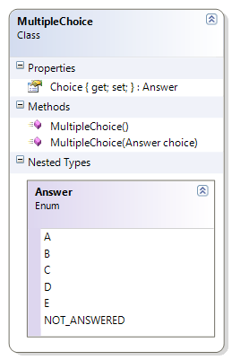
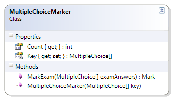

# MultipleChoiceMarker

This class is used for marking multiple choice exams. It takes an array of MultipleChoice objects as the answer key when it is first created. It provides a method to mark the student's answers. The following methods must be coded to complete the solution.

* MarkExam() - This method takes the supplied exam answers and compares them against the answers in the marking key. It then constructs a Mark object, based on the earned marks and the possible marks (each answer is worth one mark). Before marking the exam, the method must ensure that
  * The supplied array of multiple choice answers is not null
  * The supplied array of multiple choice answers has the same number of answers as the MultipleChoiceMarker's answer key
* Supporting Classes
  * MultipleChoice -




 
```csharp
    public Mark MarkExam(MultipleChoice[] examAnswers)
    {
        if (examAnswers == null)
            throw new Exception("Cannot mark null answers");
        if (examAnswers.Length != Key.Length)
            throw new Exception(
                    "The number of student answers does not match the number of items in the answer key");
        int possible = Key.Length;
        int earned = 0;
        // Calculate earned marks
        for (int index = 0; index < Key.Length; index++)
        {
            if (examAnswers[index] != null)
                if (Key[index].Choice == examAnswers[index].Choice)
                    earned++;
        }
        Mark examMark = new Mark(possible, earned);
        return examMark;
    }
```
