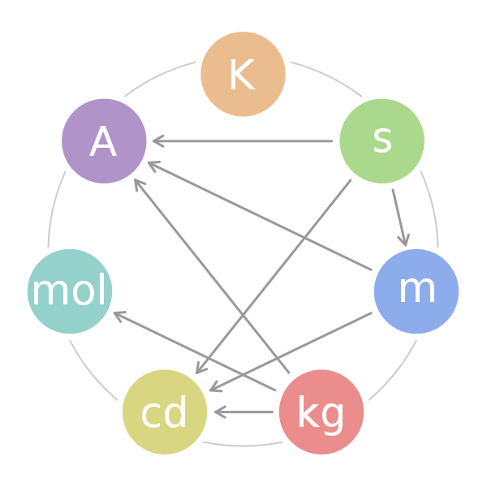

# SI System Classes



```csharp
public interface Measure {
    /// <summary>"The value of a physical quantity is the quantitative expression of a particular physical quantity as the product of a number and a unit, the number being its numerical value. Thus, the numerical value of a particular physical quantity depends on the unit in which it is expressed."</summary>
    /// <remarks>Source: https://physics.nist.gov/cuu/Units/introduction.html</remarks>
    decimal Value {get;}
    string UnitSymbol { get; }
}
```

The following classes are based on the SI System.

```csharp
public struct Meter : Measure
{
    public decimal Value { get; private set; }
    public string UnitSymbol => "m";
    public Meter(decimal value)
    {
        Value = value;
    }

    public override string ToString()
    {
        return $"{Value} {UnitSymbol}";
    }
}
```

```csharp
public struct Kilogram : Measure
{
    public decimal Value { get; private set; }
    public string UnitSymbol => "kg";
    public Kilogram(decimal value)
    {
        Value = value;
    }

    public override string ToString()
    {
        return $"{Value} {UnitSymbol}";
    }
}
```

```csharp
public struct Second : Measure
{
    public decimal Value { get; private set; }
    public string UnitSymbol => "s";
    public Second(decimal value)
    {
        Value = value;
    }

    public override string ToString()
    {
        return $"{Value} {UnitSymbol}";
    }
}
```

```csharp
public struct Kelvin : Measure
{
    public decimal Value { get; private set; }
    public string UnitSymbol => "K";
    public Kelvin(decimal value)
    {
        Value = value;
    }

    public override string ToString()
    {
        return $"{Value} {UnitSymbol}";
    }
}
```

```csharp
public struct Ampere : Measure
{
    public decimal Value { get; private set; }
    public string UnitSymbol => "A";
    public Ampere(decimal value)
    {
        Value = value;
    }

    public override string ToString()
    {
        return $"{Value} {UnitSymbol}";
    }
}
```

```csharp
public struct Mole : Measure
{
    public decimal Value { get; private set; }
    public string UnitSymbol => "mol";
    public Mole(decimal value)
    {
        Value = value;
    }

    public override string ToString()
    {
        return $"{Value} {UnitSymbol}";
    }
}
```

```csharp
public struct Candela : Measure
{
    public decimal Value { get; private set; }
    public string UnitSymbol => "cd";
    public Candela(decimal value)
    {
        Value = value;
    }

    public override string ToString()
    {
        return $"{Value} {UnitSymbol}";
    }
}
```

----

## Image Credits

- Image for "The Seven SI Units" is taken from [https://courses.lumenlearning.com/boundless-chemistry/chapter/units-of-measurement/](https://courses.lumenlearning.com/boundless-chemistry/chapter/units-of-measurement/)
