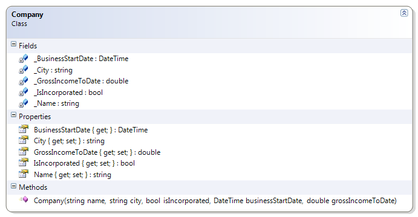
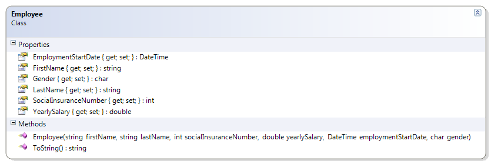

# Company and Employee

These are other classes similar to the Person and Student classes, but the Employee class uses Auto-Implemented properties (new since C# 3.0). Lastly, these classes "share" a driver, illustrating the fact that any given "program" typically uses more than one class.
 

