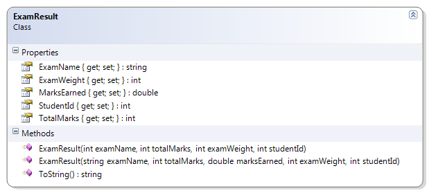

# ExamResult

This class represents the results of an exam for a student. 

**Problem Statement:**

Create the ExamResult class so that it represents the results of an exam written by a student. Design the class to have the properties and constructors as specified in this document. (Note that there are two constructors for this class.) Also create a ToString( ) method that describes the information in any given instance of this class.

Use auto-implemented properties for the entire class. Note that only the following properties should have private "set" implementations: TotalMarks, ExamName, ExamWeight, and StudentId.

 
Also create a driver for testing this class; you may use any name for the driver as long as it is not already mentioned in this namespace. In the driver, instantiate all of the exams you have taken to date in this course and populate those objects with data (use hard-coded data); if you need to, you may create fake data for the driver. 

