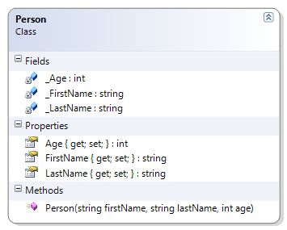

# Person

This simple class illustrates and introduces the idea of encapsulation (private fields with public properties). This example uses a constructor for ensuring the state of an object when it is instantiated (created).

Extend the Person class from the example to include a constructor that takes in a first and last name as well as an age in the parameter list.

