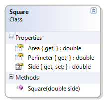

# Square

This class represents a simple square with a specified length for its side. The area and perimeter are calculated. 

**Problem Statement**

Write the code for the Square class. The solution must meet the following requirements:

* Should get and set the length of the side of the square
* Should calculate the area and perimeter

Use the following class diagram when creating your solution.



```csharp
namespace Topic.E.Examples
{
    public class Square
    {
        public Square(double side)
        {
            this.Side = side;
        }

        public double Side { get; set; }

        public double Area
        {
            get { return Side * Side; }
        }

        public double Perimeter
        {
            get { return Side * 4; }
        }
    }
}
```
