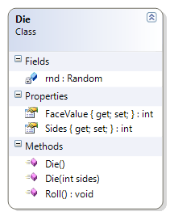

# Die

This exercise expands on the original Die class to allow for creating a die of any number of sides, with a default of six sides. This means that there is an overloaded constructor. 

**Problem Statement**

Modify the Die class from the examples to support multi-sided die other than just the standard six sides. The solution must meet the following requirements (new requirements are in **bold**):

* The Sides and FaceValue properties' set should be private.
* Should generate a six-sided die by default
* Should get the number of sides of the die
* Should randomly generate each side (if rolled enough); for example, if the die has ten sides, it should eventually roll a 1, 2, 3, 4, 5 6, 7, 8, 9, and 10

Use the following class diagram when creating your solution.

