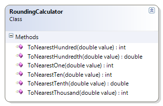

# RoundingCalculator

This exercise demonstrates rounding using separate methods for each level of rounding precision.

**Problem Statement**

Write the code needed to provide rounding of various degrees of accuracy. The solution must meet the following requirements:

* All of the methods should be static.
* Should correctly round up to the nearest thousand
* Should correctly round down to the nearest thousand
* Should correctly round up to the nearest hundred
* Should correctly round down to the nearest hundred
* Should correctly round up to the nearest ten
* Should correctly round down to the nearest ten
* Should correctly round up to the nearest one
* Should correctly round down to the nearest one
* Should correctly round up to the nearest tenth
* Should correctly round down to the nearest tenth
* Should correctly round up to the nearest hundredth
* Should correctly round down to the nearest hundredth

Use the following class diagram when creating your solution.

