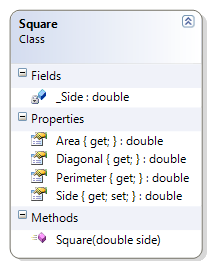

# Square

Only accepts positive, non-zero lengths for the side.

**Problem Statement**

Write the code needed to add the ability for a Square to determine the length of its diagonal. The solution must meet the following requirements (new requirements are in **bold**):
* Should get and set the length of the side of the square
* Should calculate the area, perimeter, and diagonal of the square
* **Should only accept positive, non-zero lengths for the side**

Use the following class diagram when creating your solution.


 
```csharp
    private double _Side;
    public double Side
    {
        get
        {
            return _Side;
        }
        set
        {
            if (value <= 0)
                throw new System.Exception("A square must have a positive non-zero length for its side");
            _Side = value;
        }
    }
```
