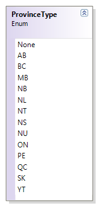
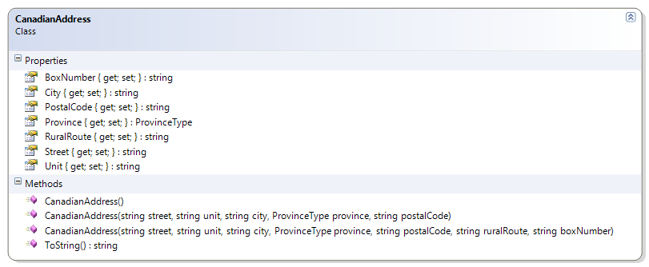

# CanadianAddress + Province

The CanadianAddress class is modified to now use a ProvinceType enumeration to properly capture the provinces and territories of Canada.

**Problem Statement**

Modify the CanadianAddress class to now use an enumeration for the province. Use the following class diagram as a guide in creating the class and the enumeration.

