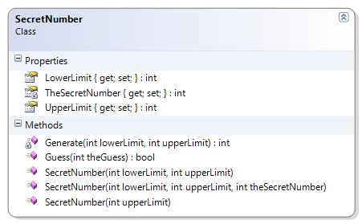
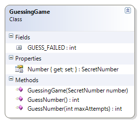

# GuessingGame

This example uses a supplied class called SecretNumber, which picks a random whole number between a specific range. An instance of the SecretNumber is passed to the constructor of the GuessingGame, and the GuessingGame’s Guess() method attempts to get the correct guess within a specified number of tries.

In a regular number guessing game between two people, one person asks another person to guess a whole number between a pair of values. In this example, two different classes take on the roles of the two people in the game: The SecretNumber class takes on the role of the person who has picked a value between some lower and upper limit, while the GuessingGame class takes on the role of the person who has to guess what that hidden number is.

*Note:* This class is already coded for you in the samples.

**SecretNumber**

Objects of this class will store a hidden value between some upper and lower limit (inclusive). The SecretNumber class supports three public methods:

* GetLowerLimit() – Returns a number representing the lower end (inclusive) of the range of possible values for the hidden value.
* GetUpperLimit() – Returns a number representing the upper end (inclusive) of the range of possible values for the hidden value.
* Guess() – Returns true if the supplied value matches the hidden value, otherwise it returns false.


 
**GuessingGame**

This class simulates the action of guessing what hidden value is stored inside of a SecretNumber object. The SecretNumber is supplied to the constructor of the GuessingGame, and the following methods attempt to find out what that number is.

* GuessNumber() – This first method simply tries to guess the hidden value of the SecretNumber. It has “unlimited” guesses, and it will return the number of attempts it took to find out what that hidden number is.
* GuessNumber(MaxAttempts : Integer) – This method will also try to guess the SecretNumber’s hidden value, but it is limited to a maximum number of guesses. This method will return the actual number of attempts it took to find the hidden value, or it will return the GUESS_FAILED constant if it was unable to guess the secret number.

Try creating alternate versions of this GuessingGame that will use a while statement and a for statement in the GuessNumber methods.


 
```csharp
public class GuessingGame
{
    private SecretNumber Number { get; set; }
    public const int GUESS_FAILED = -1;

    public GuessingGame(SecretNumber number)
    {
        if (number == null)
            throw new System.Exception("SecretNumber cannot be null");
        this.Number = number;
    }

    public int GuessNumber(int maxAttempts)
    {
        int numberOfAttempts = 0;
        bool correct = false;
        while (maxAttempts > 0 && !correct)
        {
            // Make a guess
            int myBestGuess = Rnd.Next(Number.LowerLimit, Number.UpperLimit);
            if (Number.Guess(myBestGuess))
                correct = true;
            numberOfAttempts++;
            maxAttempts--;
        }
        if (!correct)
            numberOfAttempts = GUESS_FAILED; // a "flag" to say the guess was incorrect
        return numberOfAttempts;
    }

    public int GuessNumber()
    {
        bool correct = false;
        int numberOfAttempts = 0;
        while (numberOfAttempts < int.MaxValue && !correct)
        {
            // Make a guess
            int myBestGuess = Rnd.Next(Number.LowerLimit, Number.UpperLimit);
            if (Number.Guess(myBestGuess))
                correct = true;
            numberOfAttempts++;
        }
        if (!correct)
            numberOfAttempts = GUESS_FAILED;
        return numberOfAttempts;
    }
}
```
