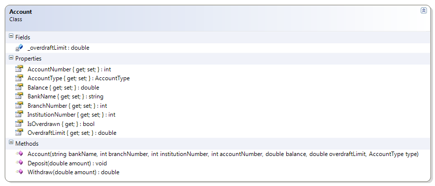
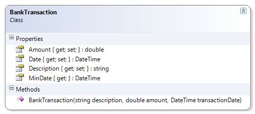
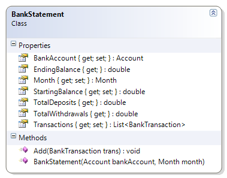

---
--# BankStatement

This class represents a bank statement for a BankAccount for a given month. The statement allows BankTransaction objects to be added, and performs deposits and withdrawals on the BankAccount. The statement reports the starting and ending balance and also summarizes the total amount deposited and withdrawn for the month. The following methods must be coded to complete the solution.

* GetTotalDeposits() – Loop through the collection of transactions to total all those transactions with a positive amount.
* GetTotalWithdrawals() – Loop through the collection of transactions to total all those transactions with a negative amount.

**Account and BankTransaction**





**Bank Statement**



```csharp
public class BankStatement
{
    public Account BankAccount { get; private set; }
    public double StartingBalance { get; private set; }
    public Month Month { get; private set; }
    public List<BankTransaction> Transactions { get; private set; }
    public double EndingBalance
    {
        get
        {
            return BankAccount.Balance;
        }
    }


    public BankStatement(Account bankAccount, Month month)
    {
        if (bankAccount == null)
            throw new System.Exception("Bank account cannot be null");
        this.BankAccount = bankAccount;
        this.StartingBalance = bankAccount.Balance;
        this.Month = month;
        this.Transactions = new List<BankTransaction>();
    }

    public void Add(BankTransaction trans)
    {
        if (trans == null)
            throw new System.Exception("Cannot add null transactions");
        double amount = trans.Amount;
        if (amount < 0)
            BankAccount.Withdraw(-amount); // Amount is "negated" to make positive
        else
            BankAccount.Deposit(amount);
        Transactions.Add(trans);
    }

    public double TotalDeposits
    {
        get
        {
            double total = 0;
            for (int index = 0; index < Transactions.Count; index++)
            {
                BankTransaction aTransaction = Transactions[index];
                if (aTransaction.Amount > 0)
                    total += aTransaction.Amount;
            }
            return total;
        }
    }

    public double TotalWithdrawals
    {
        get
        {
            double total = 0;
            foreach (BankTransaction aTransaction in Transactions)
                if (aTransaction.Amount < 0)
                    total += aTransaction.Amount;
            return total;
        }
    }
}
```
