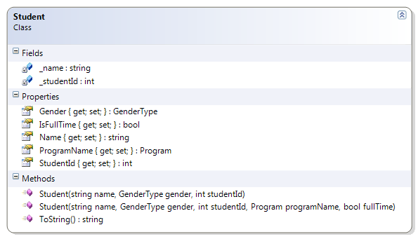
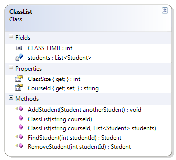

# ClassList

The ClassList example maintains a list of students for a particular course by offering methods to add and remove students from a course. In addition, the ClassList ensures that students are not added to the course twice (based on the student’s Id). The following parts of the ClassList must be coded to complete the solution.

* Constructor – Set the course id and the collection of students. Ensure that the supplied arguments are valid
  * CourseId cannot be empty or null, and must be trimmed of leading or trailing spaces
  * The collection object cannot be null and cannot have more students than the constant CLASS_LIMIT
  * There cannot be any duplicate students in the collection (where a duplicate is defined as two or more Student objects with identical Ids)
* AddStudent() – Add the supplied student object to the collection. Ensure that
  * The Student object is not null
  * The class limit is not exceeded
  * The Student object does not already exist in the collection (that is, there are no duplicates allowed, based on the student’s id)
* FindStudent() – Search the collection for a Student with a matching Id. If none is found, return null.
* RemoveStudent() – Search for a Student with a matching Id; if one is found, remove it from the collection.

**Student**



**ClassList**



```csharp
public class ClassList
{
    public const int CLASS_LIMIT = 25;
    public string CourseId { get; private set; }
    private List<Student> students;

    public ClassList(string courseId, List<Student> students)
    {
        if (String.IsNullOrEmpty(courseId) || string.IsNullOrEmpty(courseId.Trim()))
            throw new Exception("Course Id is required");
        if (students == null)
            throw new Exception("Students cannot be a null list");
        if (students.Count > CLASS_LIMIT)
            throw new Exception("Class Limit Exceeded");
        for (int index = 0; index < students.Count - 1; index++)
        {
            int id = students[index].StudentId;
            for (int innerLoop = index + 1; innerLoop < students.Count; innerLoop++)
                if (students[innerLoop].StudentId == id)
                    throw new Exception(
                            "Duplicate student Ids not allowed in the class list");
        }
        this.CourseId = courseId.Trim();
        this.students = students;
    }

    public ClassList(string courseId) :
        this(courseId, new List<Student>())
    {
    }

    public int ClassSize
    {
        get
        {
            return students.Count;
        }
    }

    public void AddStudent(Student anotherStudent)
    {
        if (anotherStudent == null)
            throw new Exception("Cannot add null student");
        if (students.Count >= CLASS_LIMIT)
            throw new Exception("Class Limit Exceeded - Cannot add student");
        for (int index = 0; index < students.Count - 1; index++)
        {
            int id = students[index].StudentId;
            if (anotherStudent.StudentId == id)
                throw new Exception(
                        "Duplicate student Ids not allowed in the class list");
        }
        students.Add(anotherStudent);
    }

    public Student FindStudent(int studentId)
    {
        Student found = null;
        for (int index = 0; index < students.Count && found == null; index++)
            if (students[index].StudentId == studentId)
                found = students[index];
        return found;
    }

    public Student RemoveStudent(int studentId)
    {
        Student found = FindStudent(studentId);
        if (found != null)
            students.Remove(found);
        return found;
    }
}
```
