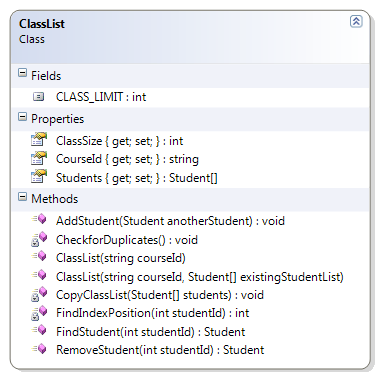

# ClassList

The ClassList example maintains an array of students for a particular course by offering methods to add and remove students from a course. In addition, the ClassList ensures that students are not added to the course twice (based on the student's Id). The internal array is of a fixed size (ClassList.CLASS_LIMIT) as well as the logical size of the array. If the ClassList is provided with an array of students in its constructor, that list is “copied” to the internal array of the ClassList object.

* Constructor - Set the course id and the array of students. Ensure that the supplied arguments are valid
  * CourseId cannot be empty or null, and must be trimmed of leading or trailing spaces
  * The array of students cannot be null and cannot have more students than the constant CLASS_LIMIT
  * There cannot be any duplicate students in the array (where a duplicate is defined as two or more Student objects with identical Ids)
* AddStudent() - Add the supplied student object to the array. Ensure that
  * The Student object is not null
  * The class limit is not exceeded
  * The Student object does not already exist in the array (that is, there are no duplicates allowed, based on the student's id)
* FindStudent() - Search the array for a Student with a matching Id. If none is found, return null.
* RemoveStudent() - Search for a Student with a matching Id; if one is found, remove it from the array.
* Supporting Classes
  * Student - 




```csharp
public class ClassList
{
    public const int CLASS_LIMIT = 25;
    public string CourseId { get; private set; }
    public Student[] Students { get; private set; }
    public int ClassSize { get; private set; }

    public ClassList(string courseId) :
        this(courseId, new Student[CLASS_LIMIT])
    {
    }

    public ClassList(string courseId, Student[] existingStudentList)
    {
        if (String.IsNullOrEmpty(courseId) || string.IsNullOrEmpty(courseId.Trim()))
            throw new Exception("Course Id is required");
        if (existingStudentList == null)
            throw new Exception("Students cannot be a null list");
        if (existingStudentList.Length > CLASS_LIMIT)
            throw new Exception("Class Limit Exceeded");
        CopyClassList(existingStudentList);
        CheckforDuplicates();
        this.CourseId = courseId.Trim();
    }

    private void CopyClassList(Student[] students)
    {
        ClassSize = 0;
        this.Students = new Student[CLASS_LIMIT];
        for (int i = 0; i < students.Length; i++)
        {
            if (students[i] != null)
            {
                this.Students[ClassSize] = students[i];
                ClassSize++;
            }
            else
                break; // Treat the first null instance as a "flag" indicating the end of actual student objects in the array
        }
    }

    private void CheckforDuplicates()
    {
        for (int index = 0; index < ClassSize - 1; index++)
        {
            int id = Students[index].StudentId;
            for (int innerLoop = index + 1; innerLoop < ClassSize; innerLoop++)
                if (Students[innerLoop].StudentId == id)
                    throw new Exception(
                            "Duplicate student Ids not allowed in the class list");
        }
    }

    public void AddStudent(Student anotherStudent)
    {
        if (anotherStudent == null)
            throw new Exception("Cannot add null student");
        if (ClassSize >= CLASS_LIMIT)
            throw new ArrayFullException("Class Limit Exceeded - Cannot add student");
        for (int index = 0; index < ClassSize - 1; index++)
        {
            int id = Students[index].StudentId;
            if (anotherStudent.StudentId == id)
                throw new Exception(
                        "Duplicate student Ids not allowed in the class list");
        }
        Students[ClassSize] = anotherStudent;
        ClassSize++;
    }

    public Student FindStudent(int studentId)
    {
        Student found = null;
        int foundPosition = FindIndexPosition(studentId);
        if (foundPosition >= 0)
            found = Students[foundPosition];
        return found;
    }

    private int FindIndexPosition(int studentId)
    {
        int foundPosition = -1;
        for (int index = 0; index < ClassSize; index++)
            if (Students[index].StudentId == studentId)
                foundPosition = index;
        return foundPosition;
    }

    public Student RemoveStudent(int studentId)
    {
        Student found = null;
        int foundPosition = FindIndexPosition(studentId);
        if (foundPosition >= 0)
        {
            found = Students[foundPosition];
            Students[foundPosition] = Students[ClassSize - 1];
            ClassSize--;
        }
        return found;
    }
}
```
