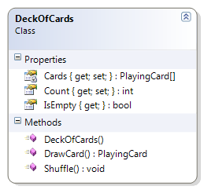

# DeckOfCards

The DeckOfCards class represents a complete deck of cards. When the deck is first created, a card is created for each suit. The DeckOfCards supports a method to draw a card. The following methods must be coded to complete the solution.

* Constructor - Create all the cards for all the CardSuit values and all the CardValue values.
* DrawCard() - Return the card at the “top” of the deck (that is, at position zero). If the deck is empty, return a null.
* IsEmpty - Returns true if the logical size of the deck of cards has reached zero, otherwise it returns false.
* Supporting Classes
  * PlayingCard - The PlayingCard class, along with its two enumerated types CardSuit and CardValue, are the basis for the DeckOfCards class.




```csharp
public class DeckOfCards
{
    private PlayingCard[] Cards { get; set; }
    public int Count { get; private set; }
    public bool IsEmpty { get { return Count == 0; } }

    public DeckOfCards()
    {
        Cards = new PlayingCard[52];

        foreach (PlayingCard.CardSuit suit in System.Enum.GetValues(typeof(PlayingCard.CardSuit)))
            foreach (PlayingCard.CardValue value in System.Enum.GetValues(typeof(PlayingCard.CardValue)))
            {
                Cards[Count] = new PlayingCard(value, suit);
                Count++;
            }
    }

    public PlayingCard DrawCard()
    {
        PlayingCard card = null;
        if (Count != 0)
        {
            // get the first card
            card = Cards[0];
            // "pull" the other items up in the array
            for (int i = 0; i < Count - 1; i++)
            {
                Cards[i] = Cards[i + 1];
            }
            // "clear" the last element & adjust the count
            Cards[Count - 1] = null;
            Count--;
        }
        return card;
    }

    public void Shuffle()
    {
        for (int counter = 0; counter < 100; counter++)
        {
            int index = Rnd.Next(Count);
            PlayingCard card = Cards[0];
            Cards[0] = Cards[index];
            Cards[index] = card;
        }
    }
}
```
