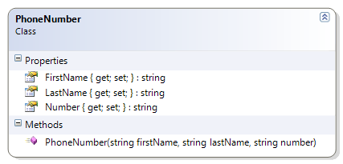
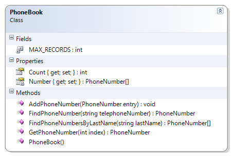

# PhoneBook

The PhoneBook class provides simple management of an array of PhoneNumber objects. The PhoneBook allows for adding and retrieving phone numbers; it supports search for phone numbers by the telephone number or by a last name. The PhoneBook is initialized with a physical limit for the arrays, and the actual number of entries in the phone book is tracked as phone numbers are added to the phone book.

* Constructor - Create a new array of PhoneNumber objects for the numbers field.
* AddPhoneNumber(Entry : PhoneNumber) - Add a PhoneNumber to the array. Ensure that the PhoneNumber exists (is not null) before adding; if the PhoneNumber is null, throw an exception. If there isn't any room to add the PhoneNumber, then throw an exception.
* GetPhoneNumber(Index : Integer) : PhoneNumber - Get an item from a particular position in the array.
* Count : Integer - Get the logical size of the array.
* FindPhoneNumber(TelephoneNumber : String) : PhoneNumber - Look through the array and return a PhoneNumber with a matching telephone number. If none is found, return null.
* FindPhoneNumbersByLastName(LastName : String) : PhoneNumber[ ] - Look through the array for PhoneNumber objects with a matching last name. Add those objects to a new array and return it. If no items are found, return an empty array.
* Supporting Classes
  * ArrayFullException - This class is used to indicate that the array is full and no more items can be added to the array.
  * PhoneNumber - This class contains a telephone number and the name that the number is registered to. 





 
```csharp
public class PhoneBook
{
    private const int MAX_RECORDS = 1000;
    private PhoneNumber[] Number { get; set; }
    public int Count { get; private set; }

    public PhoneBook()
    {
        Number = new PhoneNumber[MAX_RECORDS];
    }

    public void AddPhoneNumber(PhoneNumber entry)
    {
        if (entry == null)
            throw new System.Exception("The phone number entry cannot be null");
        if (Count == MAX_RECORDS)
            throw new ArrayFullException("The phone book cannot hold any more Phone Numbers");

        Number[Count] = entry;
        Count++;
    }

    public PhoneNumber GetPhoneNumber(int index)
    {
        return Number[index];
    }

    public PhoneNumber FindPhoneNumber(string telephoneNumber)
    {
        PhoneNumber found = null;
        int foundIndex = -1;
        for (int index = 0; index < Count; index++)
        {
            if (Number[index].Number.Equals(telephoneNumber))
            {
                foundIndex = index;
                break;
            }
        }
        if (foundIndex >= 0)
            found = Number[foundIndex];
        return found;
    }

    public PhoneNumber[] FindPhoneNumbersByLastName(string lastName)
    {
        PhoneNumber[] found = new PhoneNumber[MAX_RECORDS];
        // Find the numbers
        int foundCounter = 0;
        for (int index = 0; index < Count; index++)
        {
            PhoneNumber item = Number[index];
            if (item.LastName.Equals(lastName))
            {
                found[foundCounter] = item;
                foundCounter++;
            }
        }

        // Trim the array
        PhoneNumber[] foundTrimmed = new PhoneNumber[foundCounter];
        for (int index = 0; index < foundCounter; index++)
        {
            foundTrimmed[index] = found[index];
        }

        return foundTrimmed;
    }
}
```
